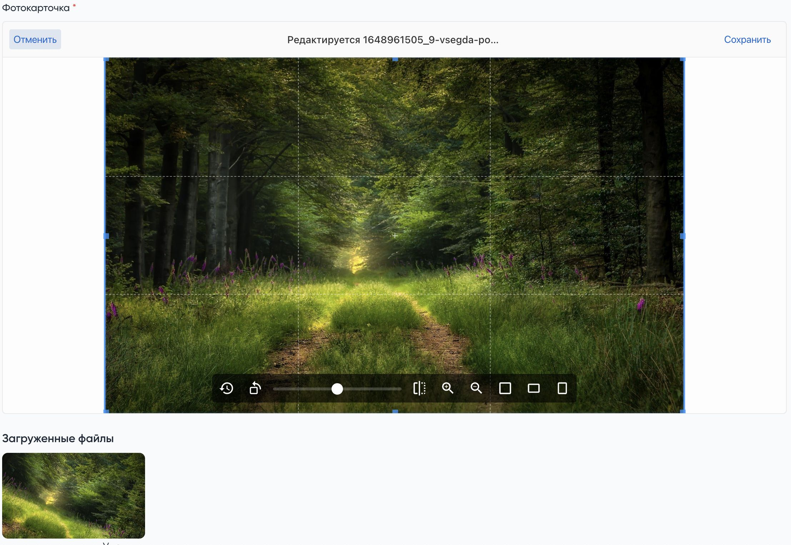

# Spatie + Uppy поле для загрузки файлов и изображений для Moonshine админ панеле

## Установка
```shell
composer require gian_tiaga/moonshine-file
```

## Usage
Сначала установите пакет от spatie
[https://spatie.be/docs/laravel-medialibrary
](https://spatie.be/docs/laravel-medialibrary)

Потом настройте свои модели

После в своих ресурсах пожно использовать поле
```php
SpatieUppyFile::make('Фото', 'photo')
    ->multiple()
    ->countFiles(5)
    ->image()
```

Можно указать нужны mime тип
```php
SpatieUppyFile::make('Фото', 'photo')
    ->allowedFileTypes('video/*')
```


Поле можно использовать внутри JSON

Но есть нюанс: 

Значение не будет добавлено в модель ресурса, а сохранится в json как массив с привязкой к общей моделе Media, поэтому нужно указать cast где вы по ид сможете создать модель и пользоваться полями.
